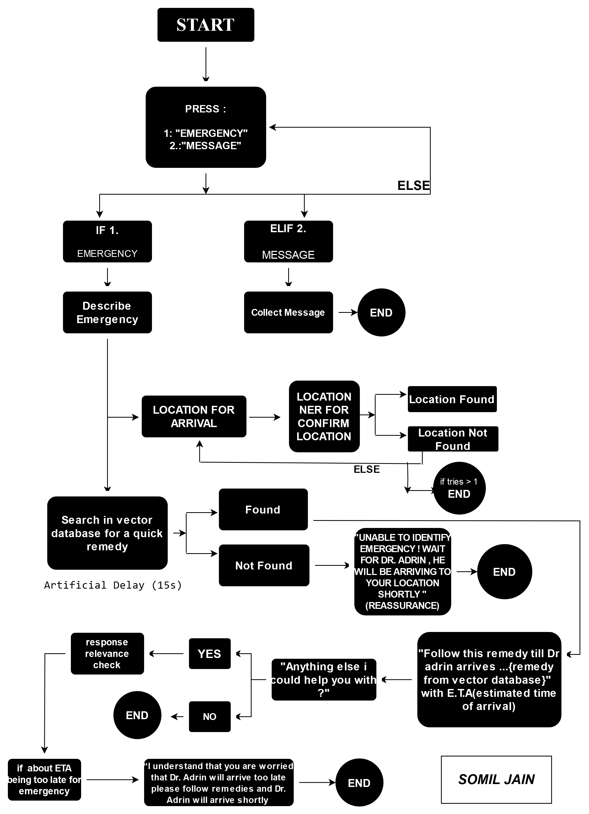
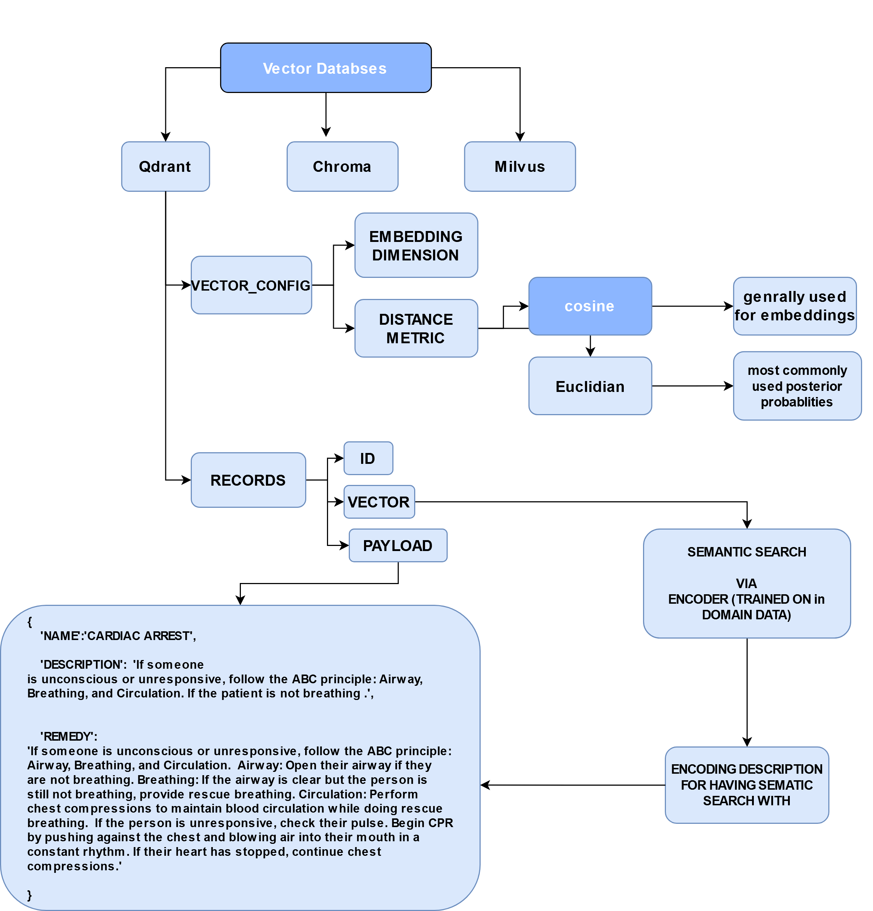
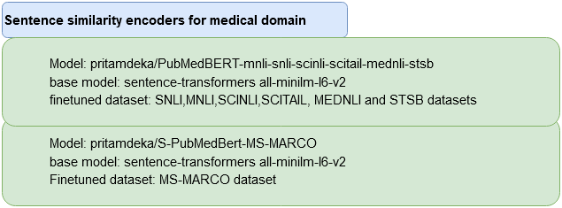

## Receptionist Bot assisting a Doctor 
<p align="center"></p>

### INSTRUCTIONS FOR INFERENCING
```
- pip install -r requirements.txt
- docker run -p 6333:6333 qdrant/qdrant
```
<p align="center"></p>

```
- Generate vector database for semantic search
- python vector_database.py

```

### Encoders available
<p align="center"></p>

```
- Run all cells in jupyter notebook 'E2E.ipynb'
```

